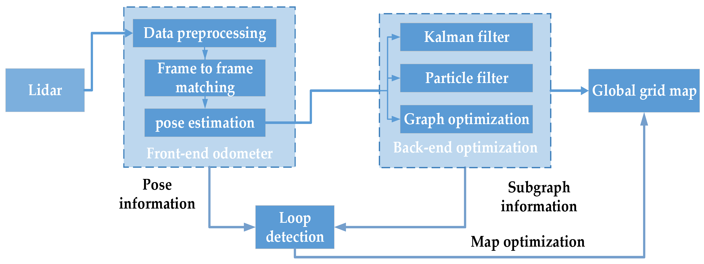
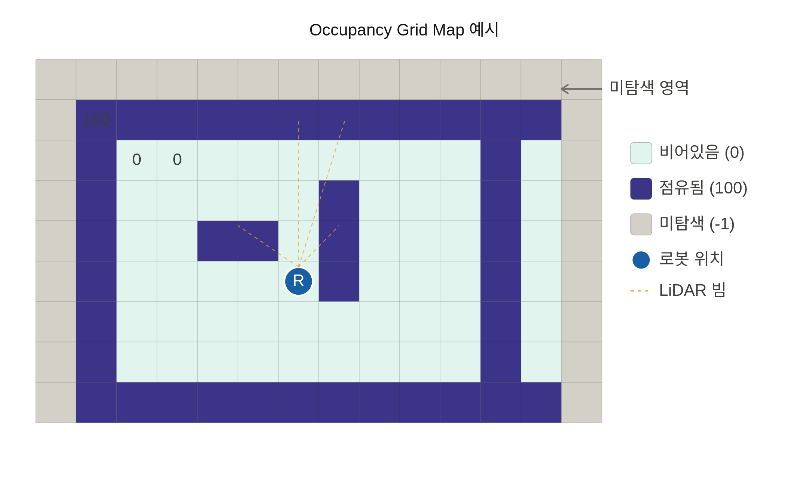
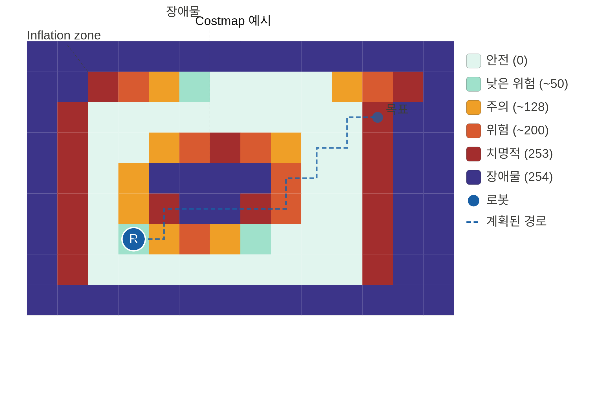

# SLAM 개념 정리: 2D LiDAR Framework & OGM vs Costmap

## SLAM이란?

**Simultaneous Localization and Mapping** — 로봇이 미지의 환경에서 지도를 만들면서 동시에 자신의 위치를 추정하는 기술. 카메라, LiDAR, IMU 등 다양한 센서를 활용.

---

## 2D LiDAR SLAM Framework



| 구성 요소 | 역할 |
|-----------|------|
| **LiDAR** | 주변 환경의 거리 데이터 제공 (2D 스캔) |
| **Front-end Odometer** | 연속 스캔 간 매칭(Frame to frame matching)으로 pose 추정 → 로봇이 지금 어디 있는지 |
| **Loop Detection** | 과거 방문 위치와 현재 위치를 비교해 누적 오차 감지 |
| **Back-end Optimization** | Loop 정보를 바탕으로 전체 경로 최적화 (Kalman filter / Particle filter / Graph optimization) |
| **Global Grid Map** | 최적화된 pose로 OGM(Occupancy Grid Map) 생성 |

### Front-end 흐름
```
LiDAR 스캔 → Data preprocessing → Frame to frame matching → Pose estimation
```
### Back-end 흐름
```
Loop detection ──┐
                 ▼
         Back-end optimization → Global grid map
```

---

## OGM (Occupancy Grid Map) vs Costmap

### OGM — 원본 지도



SLAM이 생성하는 **환경 사실 지도**. 각 셀을 세 가지 상태로 기록.

| 값 | 의미 |
|----|------|
| `0` | 비어있음 (free) |
| `100` | 점유됨 (occupied) — 벽/장애물 |
| `-1` | 미탐색 (unknown) |

### Costmap — 판단용 지도



OGM을 가져와서 **"로봇이 여기를 지나가면 얼마나 위험한가"** 를 0~254 숫자로 계산한 지도. Nav2 경로 계획에 직접 사용.

| 값 | 의미 |
|----|------|
| `0` | 안전 |
| `~50` | 낮은 위험 |
| `~128` | 주의 |
| `~200` | 위험 |
| `253` | 치명적 |
| `254` | 장애물 (lethal) |

**Inflation Layer**: 벽/장애물 셀 주변을 일정 반경으로 팽창시켜 로봇이 벽 근처로 붙지 않도록 비용을 부여. 로봇 반경(footprint)을 반영한 안전 마진.

### 한 줄 비교

| | OGM | Costmap |
|--|-----|---------|
| **목적** | 환경 사실 기록 | 경로 계획용 위험도 계산 |
| **생성 주체** | SLAM | Nav2 (costmap_2d) |
| **값 범위** | 0 / 100 / -1 | 0 ~ 254 |
| **Inflation** | 없음 | 있음 |

---

## SLAM 실행 → 맵 파일 생성 흐름

### 전체 흐름

```
1. SLAM 노드 실행
        ↓
2. 로봇 센서 데이터 수집

   [Create3 내부]
   바퀴 엔코더 + IMU → 펌웨어가 내부 계산
     → /robot8/odom 토픽 publish
     → tf (odom → base_link) publish  ← slam_toolbox가 여기서 읽음

   [slam_toolbox가 직접 구독하는 것]
   /robot8/scan  (LiDAR)  → 직접 subscribe
   tf (odom → base_link)  → TF tree에서 읽음

   ※ /odom, /imu 토픽은 slam_toolbox가 직접 구독하지 않음
        ↓
3. slam_toolbox가 /robot8/map 토픽에 OccupancyGrid publish
   (Transient Local QoS — 마지막 맵 보존)
        ↓
4. Undock → teleop으로 돌아다니며 맵 확장
   (이동할수록 미탐색 영역이 채워짐)
        ↓
5. map_saver_cli 실행 → /robot8/map 토픽 수신
        ↓
6. 파일 저장
   first_map.yaml  (메타데이터)
   first_map.pgm   (흑백 이미지)
```

### 각 단계 상세

#### 1단계: SLAM 노드 실행
```bash
ros2 launch turtlebot4_navigation slam.launch.py namespace:=/robot8
```
이 시점부터 `/robot8/map` 토픽 생성됨.

#### 2단계: slam_toolbox 내부 처리
```
/scan 수신
  → TF(odom → base_link)로 로봇의 현재 예측 위치 파악
  → 예측 위치 기반으로 scan matching → 정확한 위치 보정
  → 루프 클로저: 이미 지나간 곳 다시 방문 시 오차 누적 보정
  → OccupancyGrid 업데이트 후 /map 토픽 publish
  → 보정된 위치를 /pose 로 publish
  → map → odom 변환을 tf로 publish (오차 보정량 반영)
```

#### 4단계: teleop으로 맵 확장
```
처음: 로봇 주변만 탐색 (작은 맵)
이동 후: [회색 미탐색] → [흰/검 탐색 완료]
```

#### 5단계: map_saver_cli
```bash
ros2 run nav2_map_server map_saver_cli -f "first_map" \
  --ros-args -p map_subscribe_transient_local:=true -r __ns:=/robot8
```
- Transient Local QoS로 구독 → 이미 발행된 최신 맵도 수신 가능
- `/robot8/map` 한 번 받아서 파일로 변환

#### 6단계: 생성 파일

**`first_map.yaml`** — 맵 메타데이터
```yaml
image: first_map.pgm
resolution: 0.05           # 1픽셀 = 5cm
origin: [-1.23, -2.34, 0]  # 맵 원점 (실제 좌표)
occupied_thresh: 0.65      # 이 값 이상이면 장애물
free_thresh: 0.25          # 이 값 이하면 빈 공간
```

**`first_map.pgm`** — 실제 지도 이미지
```
흰색 = 빈 공간 (0)
검은색 = 장애물 (100)
회색 = 미탐색 (-1)
```
두 파일은 항상 같은 디렉토리에 있어야 함 (yaml이 pgm을 참조).

---

## 참고

- ROS2 Nav2: `nav2_costmap_2d` 패키지가 OGM을 받아 costmap 생성
- global costmap: 전체 지도 기반 장기 경로 계획
- local costmap: 센서 실시간 데이터 기반 장애물 회피
